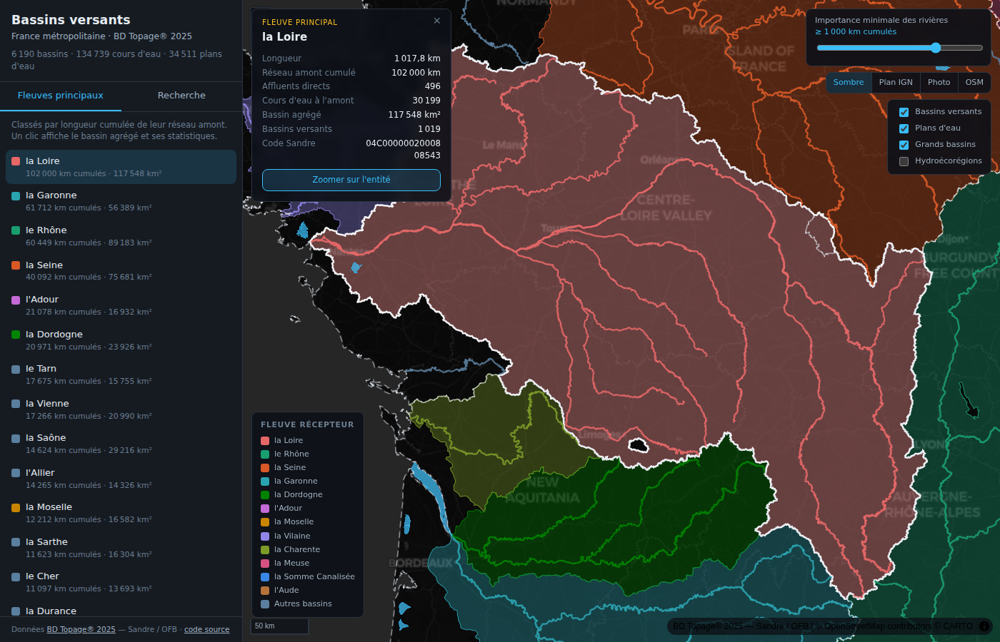

# hydro-viz — Bassins versants et fleuves de France

Carte web interactive des **bassins versants de France métropolitaine**, de son
réseau hydrographique et de ses fleuves principaux, à partir des données ouvertes
**BD Topage® 2025** du Sandre / OFB. Aucun backend, aucune clé API : tout est
pré-calculé et servi en statique.

**Démo : https://hydro.devprocore.com** (miroir : https://sharper8.github.io/hydro-viz/)



## Ce que la carte montre

- Les **6 190 bassins versants topographiques** de la métropole, teintés selon le
  **fleuve dans lequel ils se jettent** — le bassin de la Saône et celui du Doubs
  portent la couleur du Rhône, on lit d'un coup d'œil « qui va avec quoi ».
- Les **134 739 cours d'eau**, épaissis et colorés selon leur importance, avec un
  **curseur « importance minimale »** qui filtre le réseau en direct : de tout le
  chevelu jusqu'aux seuls grands fleuves.
- La liste des **48 fleuves principaux** classés par longueur cumulée amont ; un
  clic affiche le **bassin agrégé** (union pré-calculée de tous les bassins
  versants qui s'y déversent) et ses statistiques.
- À l'échelle nationale ce sont les **bassins agrégés** qui portent la lecture —
  un bassin versant topographique fait 89 km² en moyenne, illisible à z5. Les
  6 190 BVT de détail prennent le relais à partir de z7.
- Recherche plein texte, fiche d'information au clic, plans d'eau, contours des
  7 grands bassins hydrographiques et des 22 hydroécorégions.

## Les métriques, et d'où elles sortent

La couche `CoursEau` de la BD Topage ne porte **aucun attribut topologique** :
seulement un code et un nom. Le graphe amont/aval est donc reconstruit à partir
de `TronconHydrographique`, qui expose `CdNoeudDebut` / `CdNoeudFin` /
`CdCoursEau_1` — 3 021 260 tronçons et 2 920 555 nœuds pour la métropole.

| Métrique | Définition |
| --- | --- |
| `longueur_km` | longueur propre du cours d'eau (Lambert-93) |
| `cum_amont_km` | longueur cumulée de tout le réseau qui s'y déverse, la sienne comprise — le proxy « importance » |
| `nb_affluents` | cours d'eau se jetant directement dedans |
| `nb_amont_total` | nombre total de cours d'eau à l'amont |
| `main_stem_id` | fleuve principal récepteur (voir ci-dessous) |
| `stem` | rang de palette 1–12, 0 pour les bassins non teintés |

Points de méthode :

- **47 % des tronçons n'ont pas de cours d'eau rattaché** (chevelu anonyme). Ils
  sont traversés comme de simples connecteurs jusqu'au prochain tronçon nommé,
  ce qui rattache 96,7 % des cours d'eau à un récepteur.
- Le **terminal** d'une chaîne aval est presque toujours un moignon d'estuaire
  (« Passe de Saintonge » pour la Gironde : 7 km propres, 83 000 km cumulés).
  `main_stem_id` retient donc le **plus long cours d'eau de la chaîne** — la
  Garonne plutôt que la passe, la Loire plutôt que son estuaire.
- Le réseau n'est pas strictement acyclique (bras de delta, canaux réversibles) :
  24 circuits sont ouverts de force au sommet de plus faible cumul.
- Les **canaux** sont exclus du titre de « fleuve principal » — ils relient
  artificiellement des bassins — mais conservent leurs métriques.

Classement obtenu (longueur cumulée amont) :

| # | Fleuve | Cumul amont | Longueur | Cours d'eau amont | Bassin agrégé |
| --- | --- | --- | --- | --- | --- |
| 1 | la Loire | 102 000 km | 1 018 km | 30 199 | 117 548 km² |
| 2 | la Garonne | 61 712 km | 529 km | 21 836 | 56 389 km² |
| 3 | le Rhône | 60 449 km | 545 km | 14 722 | 89 183 km² |
| 4 | la Seine | 40 092 km | 830 km | 11 307 | 75 681 km² |
| 5 | l'Adour | 21 078 km | 324 km | 7 347 | 16 932 km² |
| 6 | la Dordogne | 20 971 km | 485 km | 6 311 | 23 926 km² |
| 7 | le Tarn | 17 675 km | 382 km | 6 118 | 15 755 km² |
| 8 | la Vienne | 17 266 km | 367 km | 5 370 | 20 990 km² |
| 9 | la Saône | 14 624 km | 475 km | 2 225 | 29 216 km² |
| 10 | l'Allier | 14 265 km | 425 km | 4 305 | 14 326 km² |

## Données et poids des tuiles

| Couche | Entités | PMTiles | Zooms |
| --- | --- | --- | --- |
| `cours_eau` | 134 739 | 48 Mo | z4–z12 |
| `bassins` (BVT) | 6 190 | 25 Mo | z4–z12 |
| `plans_eau` | 34 511 | 9,3 Mo | z6–z12 |
| `fleuves_bassins` (agrégés) | 48 | 430 Ko | z0–z9 |
| `bassins_hydro` (grands bassins) | 7 | 397 Ko | z0–z9 |
| `her1` (hydroécorégions) | 22 | 240 Ko | z0–z9 |

**Total : 83 Mo**, chaque archive sous les 90 Mo visés (GitHub Pages plafonne à
100 Mo par fichier). Le levier est le **minzoom par entité** : `scripts/tiles.sh`
génère des filtres tippecanoe qui, à z4, ne laissent passer que les cours d'eau
au-delà de 15 000 km cumulés, puis relâchent le seuil à chaque zoom jusqu'à tout
tuiler à partir de z12.

Superficie cumulée des bassins versants : **550 695 km²**.

## Pipeline

```
download.sh   zips BD Topage nationaux (BVT 16 Mo, CoursEau 183 Mo, PlanEau 28 Mo,
              BassinHydrographique 1,5 Mo, TronconHydrographique 742 Mo) + HER via WFS
graph.py      graphe amont/aval -> metrics_cours_eau.csv, metrics_bassins.csv, fleuves.json
aggregate.py  dissolution des bassins par fleuve -> fleuves_bassins.geojson, stems.csv/json
prepare.sh    jointures + reprojection EPSG:4326 (ogr2ogr/SQLite) -> GeoJSON par couche
index.py      index de la barre latérale -> web/public/index.json
tiles.sh      tippecanoe -> web/public/tiles/*.pmtiles
```

Le zip national « tout-en-un » pèse 1,75 Go : on prend les **zips par jeu de
données**. Contrainte mémoire (3,7 Go) tenue en traitant en flux — les 3 M de
tronçons ne sont lus qu'en table attributaire (`.dbf` extrait un bassin à la
fois, converti en CSV, puis supprimé), et les 458 Mo de géométries de cours d'eau
ne passent jamais par Python : `prepare.sh` fait tout en ogr2ogr/SQLite. Pics
mesurés : 600 Mo pour `graph.py`, 260 Mo pour `aggregate.py`, 730 Mo pour
`prepare.sh`.

## Lancer le pipeline en local

Prérequis (Ubuntu) :

```bash
sudo apt-get install -y gdal-bin tippecanoe
pip install geopandas shapely pyogrio pandas
```

Puis, en une commande (~15 min, ~1 Go de téléchargement, ~6 Go de disque) :

```bash
./scripts/run-all.sh
```

Les étapes sont aussi exécutables séparément, dans l'ordre ci-dessus.
`download.sh` est idempotent : un zip déjà présent dans `data/raw/national/`
n'est pas retéléchargé.

## Frontend

```bash
cd web
npm install
npm run dev      # http://localhost:5173/
npm run build    # -> web/dist
```

Vite + TypeScript, `maplibre-gl` + `pmtiles`. Les archives PMTiles sont lues en
Range Requests directement depuis GitHub Pages. Thème sombre par défaut sur fond
**CARTO Dark Matter** ; les fonds **Plan IGN**, **photo aérienne** (Géoplateforme)
et **OpenStreetMap** restent disponibles, avec bascule automatique sur OSM si
l'IGN ne répond pas.

La palette catégorielle des 12 plus grands bassins récepteurs a été validée
(bande de clarté, plancher de chroma, séparation daltonisme, contraste sur le
fond sombre) ; l'ordre des teintes est le résultat de cette validation, pas un
choix esthétique. La pire paire adjacente reste dans la bande d'avertissement
daltonisme : la couleur n'est donc jamais le seul canal d'identité (pastille +
nom dans la légende et la liste, surbrillance au survol, fiche nommée au clic).

## Déploiement

Le workflow GitHub Actions se déclenche à chaque push sur `main`. Les PMTiles
étant versionnés (83 Mo), le déploiement ne dépend pas de la disponibilité des
services Sandre. Pour régénérer les données depuis la source : onglet
**Actions → Déploiement GitHub Pages → Run workflow**, en cochant
`regenerer_donnees`.

Le domaine `hydro.devprocore.com` est servi via `web/public/CNAME` (DNS géré
côté Cloudflare, enregistrement CNAME DNS-only vers `sharper8.github.io`).

## Notes et limites

- Les **débits ne sont pas dans la BD Topage** (ils relèvent de Hub'Eau et de ses
  stations). Le classement « fleuve principal » repose donc sur la longueur
  cumulée amont, le nombre d'affluents et la surface de bassin — tous calculés
  localement.
- 66 bassins versants sur 6 190 n'ont pas d'exutoire renseigné et restent non
  rattachés (gris neutre).
- Un bassin appartient au bassin agrégé de **tous** les fleuves de sa chaîne aval :
  le bassin du Doubs est compté dans la Saône *et* dans le Rhône. Deux fleuves
  qui drainent exactement le même ensemble de bassins sont dédoublonnés (« Fleuve
  la Loire », l'estuaire, est absorbé par « la Loire »).
- Deux sélections cohabitent et ne coïncident pas : les **48 fleuves principaux**
  de la barre latérale (top du cumul amont) et les **12 fleuves teintés** de la
  palette (les plus grands bassins récepteurs). La Somme Canalisée draine un
  grand bassin sans figurer au classement du cumul : elle est teintée sans être
  « fleuve principal ». La dissolution porte sur l'union des deux, faute de quoi
  une couleur de la légende n'aurait aucun polygone.
- Les bassins versants sont simplifiés *avant* d'être fondus (c'est ce qui rend
  la dissolution rapide), ce qui désolidarise leurs frontières mitoyennes et
  laisse des lamelles de quelques ares. Elles sont rebouchées après coup : tout
  anneau intérieur sous 1 km² est supprimé. Sans ce nettoyage, la couche agrégée
  pesait 4,3 Mo au lieu de 0,8 Mo et la carte était mouchetée de trous.
- La barre latérale affiche au maximum 300 résultats à la fois ; la recherche est
  insensible aux accents et à la casse.

## Licence des données

BD Topage® — Sandre / OFB / IGN, sous Licence Ouverte Etalab 2.0.
Fonds de carte : © OpenStreetMap contributors © CARTO, © IGN Géoplateforme.
